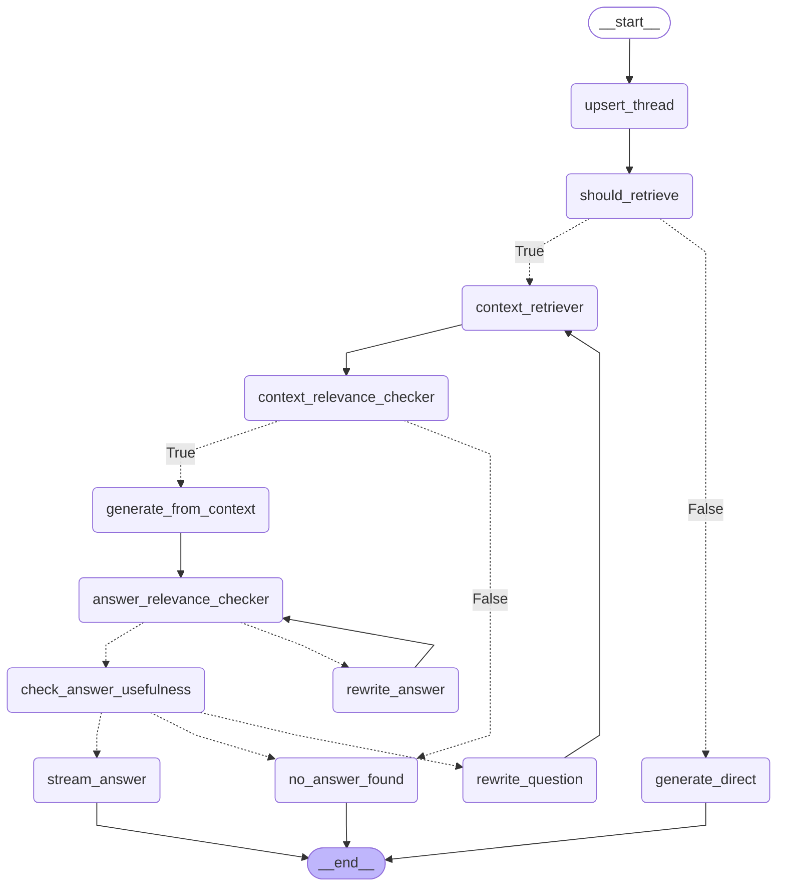

# Self-RAG — CLAUDE.md

## Project Overview

A production-ready Self-RAG API built with **FastAPI**, **LangGraph**, **PostgreSQL + pgvector**, and **Google Gemini**. It implements a full Self-RAG loop: retrieval gating, context grading, answer grounding, answer rewriting, usefulness checking, and question rewriting.

## Stack

| Layer | Technology |
|---|---|
| API | FastAPI 0.137 |
| Graph | LangGraph 1.2 |
| LLM | Google Gemini (via `langchain-google-genai`) |
| Vector DB | PostgreSQL + pgvector |
| ORM | SQLAlchemy 2 (async) |
| Migrations | Alembic |
| Background tasks | Celery + Redis |
| Python | 3.12+ |
| Package manager | uv |

## Project Structure

```
app/
├── api/            # FastAPI routers, controllers, request/response models
├── bot/
│   ├── nodes/      # One file per LangGraph node
│   ├── state.py    # RAGState (MessagesState subclass)
│   └── llm.py      # Shared LLM instance
├── rag/
│   ├── graph.py    # RAGGraph — builds and compiles the LangGraph StateGraph
│   ├── retriever.py
│   └── ingestor/   # PDF ingestion pipeline
├── db/
│   ├── models/     # SQLAlchemy ORM models
│   └── services/   # Async DB service layer
├── worker/         # Celery tasks
├── core/           # Config, logging, exceptions
└── middlewares/    # Auth, API trace
```

## Self-RAG Graph



### Node Responsibilities

| Node | Role |
|---|---|
| `upsert_thread` | Create or load the conversation thread |
| `should_retrieve` | LLM decides if retrieval is needed |
| `generate_direct` | Answer without context (conversational questions) |
| `context_retriever` | Vector search via pgvector (`top_k=3`) |
| `context_relevance_checker` | Per-doc relevance check (parallel LLM calls) |
| `generate_from_context` | Generate answer from relevant docs only |
| `answer_relevance_checker` | Grade answer: `FULLY_SUPPORTED / PARTIALLY_SUPPORTED / NOT_SUPPORTED` |
| `rewrite_answer` | Revise answer to remove unsupported claims (max 3 iterations) |
| `check_answer_usefulness` | Check if grounded answer actually answers the question |
| `rewrite_question` | Rewrite query for better retrieval (max 3 iterations) |
| `stream_answer` | Push final answer to the stream queue + persist to DB |
| `no_answer_found` | Terminal node when no answer can be found |

### Iteration Limits

- Answer rewriting: `_MAX_ANS_ITERATION = 3` (`rewrite_answer.py`)
- Question rewriting: `_MAX_QUE_ITERATION = 3` (`rewrite_question.py`)

## Key State Fields (`app/bot/state.py`)

```python
class RAGState(MessagesState):
    question: str
    answer: str
    retrieval_query: str      # rewritten query (or original question)
    rewrite_tries: int        # question rewrite iteration counter
    need_retrieval: bool
    docs: List[Document]      # raw retrieved docs
    relevant_docs: List[Document]
    context_str: str          # joined page_content of relevant_docs
    answer_relevance: Literal["FULLY_SUPPORTED", "PARTIALLY_SUPPORTED", "NOT_SUPPORTED"]
    ans_iteration: int        # answer rewrite iteration counter
    is_ans_useful: bool
    reason: str
```

## Running Locally

```bash
# Install dependencies
uv sync

# Start services
docker-compose up -d

# Run migrations
alembic upgrade head

# Start API
uvicorn app.main:app --reload

# Start Celery worker
celery -A app.celery_app worker --loglevel=info
```

## Known Issues / TODOs

- `rewrite_question_router` condition is inverted — question rewriting loop does not fire correctly (fix: swap `return "no_answer_found"` and `return "rewrite_question"`)
- `generate_direct` does not push to `stream_queue` — verify API layer handles this path
- Dead streaming code block in `generate_from_context` can be removed