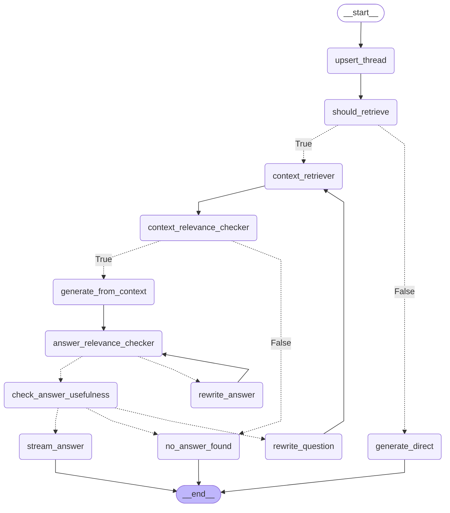

# Self-RAG

A production-ready **Self-Retrieval-Augmented Generation** API. Unlike standard RAG, every step is graded — the system decides whether to retrieve, which docs are relevant, whether the answer is grounded, and whether it actually answers the question. If any check fails, it corrects itself before responding.

Built with **FastAPI**, **LangGraph**, **PostgreSQL + pgvector**, and **Google Gemini**.

---

## Graph



---

## How It Works

### 1. Retrieval Gating
The LLM first decides if retrieval is even needed. Conversational or general questions bypass the vector search entirely and go straight to `generate_direct`.

### 2. Context Grading
Retrieved documents are checked for relevance in **parallel** — each doc gets an independent LLM call. Only relevant docs pass through to generation.

### 3. Answer Grounding (Self-RAG core)
After generation, the answer is graded against the context:
- `FULLY_SUPPORTED` → pass
- `PARTIALLY_SUPPORTED` / `NOT_SUPPORTED` → rewrite the answer (up to 3 iterations)

### 4. Usefulness Check
Even a grounded answer might not actually answer the question. A final usefulness check catches this case and either accepts the answer, rewrites the **query** for better retrieval, or gives up with `no_answer_found`.

### 5. Streaming
The final approved answer is streamed to the client in one shot. The answer is held in state during the grading/rewriting loops — streaming mid-loop would be irreversible.

---

## Stack

| | |
|---|---|
| API | FastAPI |
| Graph / Orchestration | LangGraph |
| LLM | Google Gemini |
| Vector store | PostgreSQL + pgvector |
| ORM | SQLAlchemy 2 (async) |
| Migrations | Alembic |
| Background tasks | Celery + Redis |
| Python | 3.12+ |

---

## Getting Started

### Prerequisites

- Docker & Docker Compose
- Python 3.12+
- [uv](https://github.com/astral-sh/uv)

### Setup

```bash
# 1. Clone and install
git clone <repo-url>
cd self-rag
uv sync

# 2. Configure environment
cp .env.example .env
# Fill in: DATABASE_URL, GOOGLE_API_KEY, REDIS_URL, etc.

# 3. Start services (Postgres + Redis)
docker-compose up -d

# 4. Run migrations
alembic upgrade head

# 5. Start the API
uvicorn app.main:app --reload

# 6. Start the Celery worker (for document ingestion)
celery -A app.celery_app worker --loglevel=info
```

---

## API Endpoints

| Method | Path | Description |
|---|---|---|
| `POST` | `/threads` | Create a new conversation thread |
| `POST` | `/threads/{id}/chat` | Send a message (streaming response) |
| `POST` | `/documents` | Upload a document for ingestion |
| `GET` | `/health` | Health check |

---

## Project Structure

```
app/
├── api/            # Routers, controllers, request/response models
├── bot/
│   ├── nodes/      # One file per graph node
│   ├── state.py    # RAGState definition
│   └── llm.py      # Shared LLM + parser instances
├── rag/
│   ├── graph.py    # Graph builder (RAGGraph)
│   ├── retriever.py
│   └── ingestor/   # PDF ingestion pipeline
├── db/
│   ├── models/     # SQLAlchemy ORM models
│   └── services/   # Async DB service layer
├── worker/         # Celery tasks
├── core/           # Config, logging, exception handling
└── middlewares/    # Auth, API tracing
```